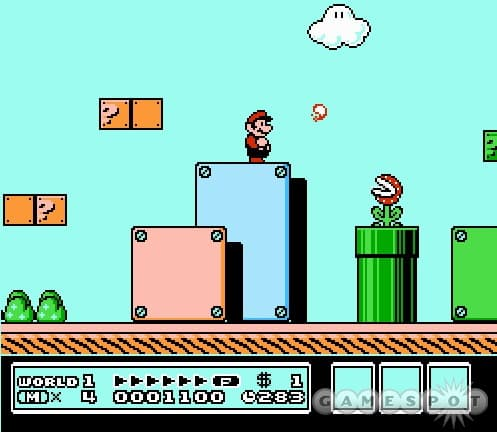

Being a middle-aged developer who grew up in the era of classic Super Nintendo gaming I have a love for the design and asthetics of Super Mario 3. The bright palettes, distinctive pixel art style, and level layouts are all brilliant. So, what could be a better idea that to try to translate that look to a webpage?

What I'm aiming for is a basic replication of the style from World 1-1. You can see what it looks like in the screenshot.

::: aside 4 black
  
:::

This is specifically from Mario 3 on the NES, which is still a fab game and worthwhile finding on a retro console or an emulator if you've not had the pleasure. The 'rivet blocks' consist of a rectangle of varying size throughout the levels, with rivets at each of the four corners. In addition to the blocks there's a ground level that's just a brown line in this particular screen, but often features lush grass in other parts of the game. That's the look I wanted to recreate.

One way to make these blocks would be to use a simple background image. That would work quite well for fixed size elements, but it wouldn't work at all for things that need to scale responsively to the user's device. Similarly I could have just used a background with `top` position and repeating in the x dimension for the ground element, but that wouldn't work well at the corners.

One more thing to note: I can't draw *at all*, and especially not in a specific style. I've used one of the Mario 3 assets from Viktor Stambert's awesome ArtStation post for the basis of the assets in this post https://www.artstation.com/artwork/ybZ4JR.

## The images

After cutting out the rivet block and grass image from the source image I was left with two images to use with image-border.

::: aside 2 white

:::

They're a little rough and as they're pixel art they could be a lot smaller but this is only a test for now. As they're pixel art they're saved as PNG format, but this could potentially be improved by using webp or even SVG. In the future I might even investigate turning them in to a CSS gradient to remove the need for any network requests.

## Using image-border

A relatively recent addition to CSS is the image-border directive. This feature takes the URL of an image and let's you use it as the border of an element, but with some additional tools to define how the image should be split up. By default it's divided in to 9 segments - three rows by three columns. The segments in the corners are used to draw the corners of the border, and the segments along the edges are used to fill in the sides, so the top middle segment defines the top border, the left middle segment defines the left border, and so on.

::: sidebar 5 code sticky
  <div>

  ### The 5 border-image properties;

  ```css
    border-image-source: url(<url>);
    border-image-slice: <slices>;
    border-image-width: <widths>;
    border-image-outset: <outsets>;
    border-image-repeat: <repeats>;
  ```

  ### An example of using the border-image properties;

  ```css
    border-image-source: url('./box2.png');
    border-image-slice: 40 44 32 44;
    border-image-width: 40px 44px 32px 44px;
    border-image-outset: 0px;
    border-image-repeat: round;
  ```

  </div>
:::

There are four different directives that can be used to tell the browser how to stretch or repeat the edge segments along the sides of the element with the image border.

- **`stretch`** A single copy of the border will be scaled to fit along the edge
- **`repeat`** The edge segment will be repeated along the edge regardless of whether it fits nicely or not
- **`round`** The edge segment will be repeated, but it'll also be resized so that it fits neatly
- **`space`** The edge segment will be repeated, but space will be left in between copies so that it fits neatly.

As a rule, the best option for most applications of image-border is `round`. It means you don't need to worry about making things specific sizes, or resizing the image-border values if an element changes.

The hardest part of using an image-border seems to be calculating the 'cut marks' that the API requires. Fortunately there's a great tool on MDN that can be used to calculate them - [Mozilla Border Image Generator](https://developer.mozilla.org/en-US/docs/Web/CSS/CSS_Background_and_Borders/Border-image_generator) - that removes the need to really bother spending time learning how it works (but still do that, just in case.)

## Putting it together

One of the many great thing about this technique is that using an PNG image for the border means I have an alpha channel that can modify the color of the background by multiplying it with the border color or background color of the element.

::: aside 2 grey fourgrid
  <div style="border-radius: 25px 25px 5px 5px; border-top: 6px solid green; border-image: url(./border.png)
    54 55 / 24px / 0 round; width: 90%; height: 150px; background-color: #fff; margin: 20px;"></div>

  <div style="border-radius: 25px 25px 5px 5px; border-top: 6px solid green; border-image: url(./border.png)
    54 55 / 24px / 0 round; width: 90%; height: 150px; background-color: #ff8; margin: 20px;"></div>

  <div style="border-radius: 25px 25px 5px 5px; border-top: 6px solid green; border-image-source: url('./box2.png'); border-image-slice: 40 44 32 44; border-image-width: 40px 44px 32px 44px; border-image-outset: 0px; border-image-repeat: round; width: 90%; height: 150px; background-color: #fbb; margin: 20px;"></div>

  <div style="border-radius: 25px 25px 5px 5px; border-top: 6px solid green; border-image-source: url('./box2.png'); border-image-slice: 40 44 32 44; border-image-width: 40px 44px 32px 44px; border-image-outset: 0px; border-image-repeat: round; width: 90%; height: 150px; background: linear-gradient(white, grey); margin: 20px;"></div>
:::

This can be seen in the rivet block example - the 'shading' along the right hand side is part of the border image. Using a light grey color with different levels of alpha means it's possible to use shading effects on divs. That's huge. In the left hand rivet block the div element has a simple background of a coral color, but in the right hand image the background is a CSS gradient that fades from white to grey. This blends nicely with the PNG to make a striking effect with very little bandwidth necessary to download everything required to make the block. What's more, any further blocks will just be CSS as the border image is only downloaded once, resulting in a great effect at very little cost.

This is a simple example of how image-border can be used to style page elements, but the properties can be used for much more. Anywhere that a graphical effect is needed to expand with the size of the element an image-border can be a useful tool.