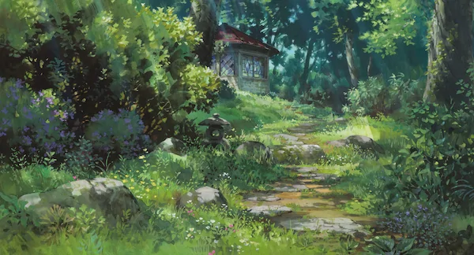

Most websites have images. And, quite honestly, they're usually terrible. Not aesthetically or artistically, but _technically_. Web developers are stuck in the past using unoptimized JPG and PNG formats that take up *way* too much bandwidth. It needs to stop.

::: aside 2 black full-width-img
  <figure>
    
    <figcaption>A standard JPG weighs in at 78Kb, but we can do so much better.</figcaption>
  </figure>
:::

Back in the early days of the web there were only two image formats. We had GIF (wih a hard gee) for illustrations and anything that needed an alpha transparency channel, and we had JPEG for photographs. That worked but GIF transparency is bit sucky so in the early 2000s browser vendors added support for PNG as well. PNG has the same 1 bit alpha channel as GIF if it's saved in an 8 bit format but it also supports 8 bit alpha in the 24 bit version. This means images can have 256 levels of see-through-ness. It was good time.

There was also support for SVG vector images in browsers but vector images are harder to make so they did quite take off as well as you might have hoped.

This is how we lived for the following 15 years or so.

::: aside 4 black full-width-img
  <figure>
    
    <figcaption>Saving as webp shrinks the image down to 58Kb.</figcaption>
  </figure>
:::

And web developers, being the creatures of habit we often are, stuck with these image formats. We made *many* assumptions about how our assets were good and small and _optimized_ because they were saved using an image editor that costs hundreds of dollars. Unfortunately for _literally everyone_ that wasn't true. There were leaps ahead in compression technology that meant those JPG and PNG images were much bigger than they need to be.

That smell is the user's bandwidth being set on fire.

Fast forward a little to today and the situation is _even worse_. JPG has been surpassed for many images. New formats like WEBP and AVIF can crunch the image data down by as much as *95%* and give a result that's indistinguishable from the original.

## JPEG and PNG in 2020

webp and AVIF formats are pretty amazing, but they're also a completely new leap and sometimes that's not what you need for an established workflow, so before getting to those it's worthwhile looking a little more at the prevelant formats that most websites already use.

JPEG is a well established format that's optimized for photographs (technically high entropy 24 bit image data, but that's photographs). It uses a discrete cosine transform to convert image data to frequencies, and then it puts everything that humans can't see in the bin. When JPEG software was first written this wasn't done particularly well though. It was good, but computers were slow so there wasn't much reason to push it. Since then though JPEG optimization software has improved a great deal, and now we have the amazing MozJPEG. MozJPEG can squeeze even more data out of a JPG image to shrink it by a good 15 - 20% further than a basic JPEG library that's included in most image editors.

What this means is that by running your photographs through MozJPEG you can reduce the size and bandwidth they take by a significant amount.

MozJPEG is free and _relatively_ simple to use.

PNG format is a similar story. PNG, or _portable network graphics_ to give it the full treatment, is a container format that can hold image data in a few different ways. There's 8 bit and 24 bit, with different alpha channels depending on what level of transparency is required in the image.

One very useful feature of PNG that most image formats don't have is support for gamma correction. This tells the browser how bright the image should be when it's displayed, so on a calibrated monitor it can represent colors correctly. No one on the web uses this feature so everyone's logos are usually displayed wrong.

PNG in image editors also has exactly the same problem as JPG - the way the editor saves a PNG is often not optimal. Thankfully PNG also has it's own brilliant optimizer in the form of OptiPNG. I don't know who names these apps but they're better at compression coding than they are at naming apps.

## webp image format

## avif image format

AVIF image format is shiny and new and based on the same codec that's used for modern video. It uses wavelet compression to reduce the amount of information needed to reproduce image data. The results are _impressive_. The Ghibli image that I've used in the sidebar to the right that weighs in at 80Kb as a JPG can be reduced by 76% to about 20Kb with no appreciable loss of quality.

::: aside 4 black full-width-img
  <figure>
    <picture>
      <source srcset="./borrower-arrietty-avif.avif" type="image/avif" />
      <source srcset="./borrower-arrietty-webp.webp" type="image/webp" />
      
    </picture>
    <figcaption>AVIF gets it down to 45Kb.</figcaption>
  </figure>
:::

There is a problem though. AVIF format is only supported by Chromium 85 based browsers. At the time of writing this post Chrome 85 has been available for about a week.

Fortunately there's a simple solution.

## Picture elements

The picture element in HTML is a modern marvel. We can effectively use it to display different images based on 'media queries'. One of the query types it understands is whether or not the browser can use a particular format. This means we can use AVIF if the user is browsing with a cutting edge Chromium-based browser, and fallback to webp or JPEG if they're not.