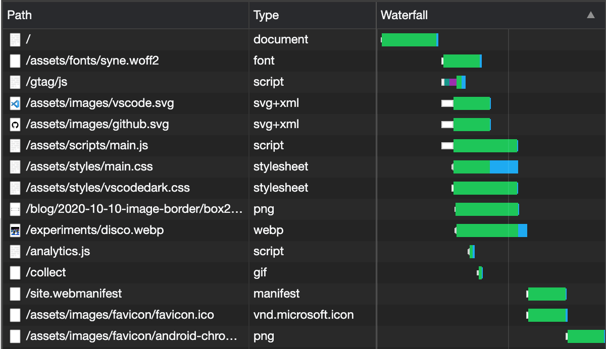
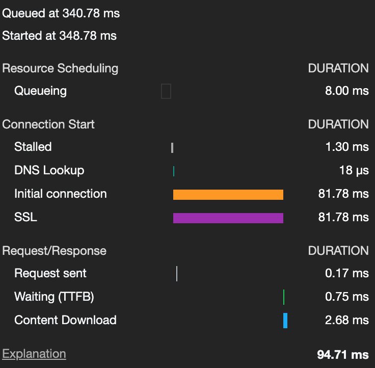

When you load a web page **a lot** happens. You click on a link or type an address in to the browser's address bar, and hopefully only a second or two later a website appears. In between those two things though, a huge amount of work has been done.

The first thing that happens is the browser works out if it's actually a valid website to load by parsing the anchor or URL. It gets broken down in to a protocol, origin (domain), path, and some GET variables if they're in the address. These are the parts that the browser needs in order to be able to tell what to request from the server that the website is on. But first it needs to work out where that server is.

## DNS, HTTP, and HTTPS

To actually get a page from the internet the browser has to do work out where the server is, and make a request to it to fetch the page. The first part of that is looking up the server's address which is achieved by resolving its domain name. This DNS lookup is the first page of the process. Once the browser has the address it can then make a request.

What happens next depends on the protocol of the page that you've requested. It's usually either `http` or `https`, and it makes a big difference whether it's one or the other. In an `http` request the content for the page can just be sent straight back to the browser as there's no encryption necessary to secure the content. This means that if someone could intercept the request the content would be plainly visible, so it's *generally* a bad idea to use `http` for anything important.

On an `https` connection the process is a little different. The server responses to the initial request with a 'handshake' and a certificate. The browser then creates a session key using the certificate and sends it back to the server. The server validates it and, assuming it's valid, sends back an acknowledgement. That's much more traffic which can make a difference on a slow connection but ultimately given the advantages of SSL and TLS security it's worthwhile.

## Getting some data

Once the browser has found where the server is and made a connection to it then the fun part can begin. The server sends the requested file to the browser - most often that's an HTML file, or the HTML output of a script that generates content. This has to be parsed, and then further assets like CSS, JS and images can be downloaded.

::: aside 6 black full-width-img
  <figure>
    <picture>
      <source srcset="waterfall-1x.webp 1x, waterfall-2x.webp 2x" />
      
    </picture>
    <figcaption>Chrome's network waterfall</figcaption>
  </figure>
:::

In the network tools tabs in Chrome devtools you can see the waterfall of downloads for a webpage. Some requests happen concurrently, but others have to wait until previous requests have completed. These are what's known as a 'blocking request' - they literally block what the browser can do until they're done.

In the example waterfall for the ooer.com homepage, you can see that the initial request has to complete before the font, CSS, JS and images are downloaded. Only once those finish are the remaining assets like the site manifest and favicon downloaded. The page isn't fully loaded until all of these files are available, so maximising concurrency is important.

Each of the bars has three sections - a white 'request sent' part, a green 'waiting' part, and finally a blue 'content download'. The white part of the bar represents how long it took the browser to actually make the request. This is usually small, but if you have a large number of requests to make it can grow significantly as the browser will queue up requests to a single origin. It can only make a maximum of 6 at a time, so if you have more it'll wait until one completes before doing another.

The green part of the line is how long the browser had to wait for the server to actually start sending data for the request - also known as the "time to first byte" (ttfb). For static files that shouldn't be more than a few milliseconds but for dynamically generated content like the result of a PHP script or NodeJS API call the ttfb time will include however long the server took to create and start sending data.

The last part of the bar, in blue, is the time it actually took to download the content from the server. This depends on how much data there is to download, how much bandwidth the server has available, and how much bandwidth the user has.

## Details for every request

Hovering the mouse pointer over any of the network waterfall bars gives more detail about where the time was spent. Each part of the request is broken down in to what the web browser was doing and how long it took.

::: aside 9 black full-width-img
  <figure>
    <picture>
      <source srcset="detail-1x.webp 1x, detail-1x.webp 2x" />
      
    </picture>
    <figcaption>Network waterfall details.</figcaption>
  </figure>
:::

- **Queueing** - Queueing is the browser preparing to make the request. Each request is automatically queued and then sent whenever the browser is ready. Usually this happens very quickly, but if there are a lot of requests to be made to complete the page it could take a while.
- **Stalled** - Stalling happens when the request is at the front of the queue but it can't actually be made yet. Again, this shouldn't happen for very long, but if it does it's *usually* due to making too many requests.
- **DNS Lookup** - To make the request the browser needs to find the address of the server. This requires a round trip to the DNS service. If the browser has already requested something from the origin it'll be cached, and much faster.
- **Initial connection** - Once the domain has been resolved the initial connection can be made to the server. It's essentially the browser saying hello.
- **SSL** - If the request is using the HTTPS scheme then several rounds of SSL and TLS handshaking will be necessary. This is an overhead that's hard to optimize though, so you don't have much choice about it.
- **Request sent** - The browser has finally made a request for the page or asset it wants to download. After this it's just a matter of waiting.
- **Waiting (TTFB)** - See. I told you. The waiting time is how long it takes for the server to actually start to send the response. This should be very fast for static assets like HTML pages and images, but if the request is for a dynamic page generated by, for example, a PHP script then it could take a lot longer.
- **Content download** - Once the content has started downloading the browser moves to the 'Content download' stage. This is the last step of the process. Obviously how long this takes depends on how much data there is to download, and how much bandwidth is available.

It isn't over yet though. Now the browser has the data it needs it still has to work to understand what that data means - that means parsing an HTML, CSS or JS file, or decompressing an image, or using some JSON from an API call.

## Browsers and HTML, CSS, and JS

